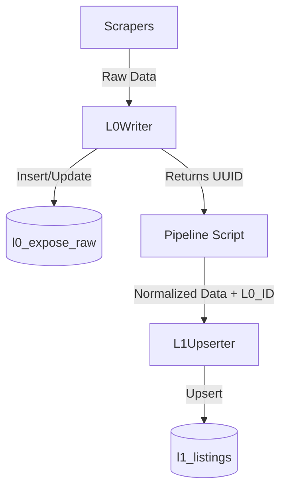

# Immo-Scan Data Pipeline: L0 & L1

The data pipeline follows a layered architecture (L0 -> L1) to ensure data integrity, history tracking, and query performance.

## Architecture Overview

---

## 1. L0 Layer: `l0_writer`
The **L0 layer** is the "Bronze" or "Raw" layer. Its primary goal is to preserve the exact data received from the scraper.

- **Storage**: Postgres table `l0_expose_raw`.
- **Deduplication**: It computes a `raw_hash` (SHA-256) of the JSON payload. This allows the system to detect if the data has actually changed between scrapes.
- **Columns**: `source`, `external_id`, `url`, `scraped_at`, `raw` (JSONB), `raw_hash`, `parser_version`.
- **Logic**: It uses an `ON CONFLICT (source, external_id) DO UPDATE` strategy to keep the latest version of the raw data for each listing.

## 2. L1 Layer: `l1_upserter`
The **L1 layer** is the "Silver" or "Normalized" layer. It extracts specific fields from the raw data into typed columns for efficient querying.

- **Storage**: Postgres table `l1_listings`.
- **Normalization**: Flattens the JSON into columns like `price_eur`, `living_space_sqm`, `rooms`, `city`, etc.
- **Traceability**: Every L1 record contains a `latest_l0_id` field, which is a UUID pointing back to the specific row in `l0_expose_raw` that provided this data.
- **Logic**: Similar to L0, it uses `ON CONFLICT (source, external_id) DO UPDATE` to maintain the current state of each listing.

---

## Example Flow in `run_immoscout_pipeline.py`

1. **Scrape**: `expose_scraper.scrape()` returns a dictionary of listing details.
2. **L0 Write**: `l0_writer.insert_expose(expose=listing)`
   - Computes hash.
   - Inserts/Updates `l0_expose_raw`.
   - Returns the database `id`.
3. **L1 Write**: `l1_upserter.upsert_listing(listing=listing)`
   - Adds `latest_l0_id` to the listing dictionary.
   - Upserts into `l1_listings`, mapping keys to database columns.
